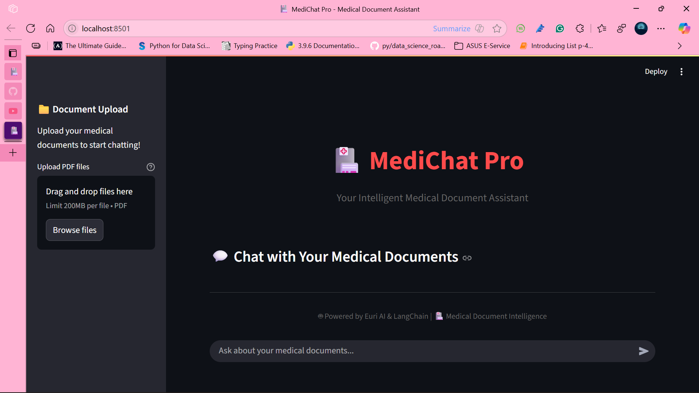

# MediBot: Your Medical Document Assistant


---

## Table of Contents

* [Description](#description)
* [Screenshot](#screenshot)
* [Features](#features)
* [Technology Stack](#technology-stack)
* [Deployment](#deployment)
* [Local Installation & Usage](#local-installation--usage)
* [Contributing](#contributing)
* [License](#license)
* [Contact](#contact)

---

## Description

**MediBot** is an intelligent medical document assistant designed to streamline the process of extracting information from multiple medical PDF files. Users can upload various PDF documents (e.g., patient records, research papers, medical guidelines), and then interact with a chatbot to ask context-specific questions. This allows for quick and efficient retrieval of information contained within the uploaded documents, making it a valuable tool for healthcare professionals, researchers, or anyone needing to navigate large volumes of medical texts.

> ⚙️ The GPT-4.1-nano model is accessed using the `euriai.langchain` package, allowing seamless integration with LangChain tools for conversational document QA.

---

## Screenshot



---

## Features

* **Multi-PDF Upload:** Easily upload and process multiple PDF documents simultaneously.
* **Contextual Chatbot:** Ask questions to the chatbot, and it will provide answers based on the content of the uploaded PDFs.
* **Intelligent Information Retrieval:** Leverages advanced NLP techniques to understand your queries and pinpoint relevant information within the documents.

---

## Technology Stack

* **Frontend:** Streamlit
* **LLM:** GPT-4.1-nano via Euri AI
* **Embeddings:** HuggingFace (Sentence Transformers)
* **Vector Store:** FAISS
* **Orchestration:** LangChain
* **PDF Parsing:** PyMuPDF / pdfminer / PyPDF2

---

## Deployment

MediBot is deployed and accessible via **Streamlit**. You can interact with the live application here:  
🔗 [MediBot App](https://shreyash-jiwane09-medibot-main-2rzlja.streamlit.app/)

---

## Local Installation & Usage

To run MediBot locally, follow these steps:

1. **Clone the repository:**

    ```bash
    git clone https://github.com/Shreyash-jiwane09/medibot.git
    cd medibot
    ```

2. **Create a virtual environment:**

    ```bash
    python -m venv venv
    ```

3. **Activate the virtual environment:**

    * On **Windows**:
        ```bash
        .\venv\Scripts\activate
        ```
    * On **macOS/Linux**:
        ```bash
        source venv/bin/activate
        ```

4. **Install dependencies:**

    ```bash
    pip install -r requirements.txt
    ```

5. **Set your EURI API key:**

    Obtain an API key from [euron.one](https://euron.one/) and set it as an environment variable.

    * Recommended: Create a `.env` file in the root directory:

        ```env
        EURI_API_KEY="your_euri_api_key_here"
        ```

    * Then load it in your Python code:

        ```python
        import os
        from dotenv import load_dotenv

        load_dotenv()
        euro_api_key = os.getenv("EURI_API_KEY")
        ```

6. **Run the Streamlit application:**

    ```bash
    streamlit run main.py
    ```

    This command will open the MediBot application in your default web browser.

---

## Contributing

We welcome contributions to MediBot! If you have suggestions for improvements, new features, or bug fixes, please feel free to:

1. Fork the repository.
2. Create a new branch for your changes (`git checkout -b feature/your-feature`).
3. Make your modifications and commit them with descriptive messages.
4. Push your branch to your forked repository.
5. Open a Pull Request to the `main` branch of this repository.

---

## License

This project is licensed under the [MIT License](LICENSE).

---

## Contact

For any questions, feedback, or collaboration:

* **Email:** shrey.jiwane09@gmail.com  
* **GitHub:** [Shreyash-jiwane09](https://github.com/Shreyash-jiwane09)
